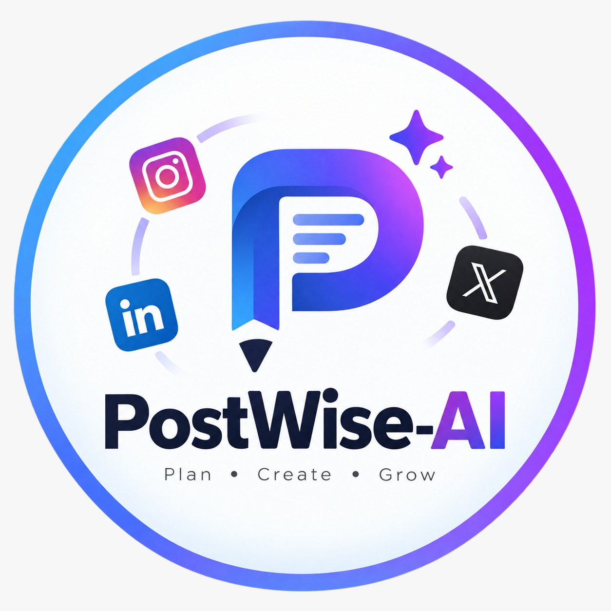

# PostWise-AI — AI-Powered Social Media Content Calendar

<p align="center">
  
</p>

<p align="center">
  <strong>Plan smarter. Post better. Grow faster.</strong><br/>
  A full-stack AI platform that transforms your brand identity into a complete 30-day social media calendar — with platform-specific captions, hashtags, imagery, and one-click LinkedIn publishing.
</p>

<p align="center">
  
  
  
  
  
</p>

---

## Table of Contents

1. [Project Overview](#project-overview)
2. [Core Features (Must-Have)](#core-features-must-have)
3. [Stretch Features (Good-to-Have)](#stretch-features-good-to-have)
4. [Tech Stack](#tech-stack)
5. [Environment Variables](#environment-variables)
6. [Backend API Reference](#backend-api-reference)
7. [Getting Started](#getting-started)
8. [Quick Start Guide](#quick-start-guide)
9. [License](#license)

---

## Project Overview

**PostWise-AI** is a modern, full-stack AI-powered social media management platform. Users provide their brand name, niche, target audience, and tone of voice — then specify their posting goals. The AI engine instantly generates a **30-day, platform-specific content calendar** with captions, hashtags, visual prompts, and engagement tips tailored to each platform.

---

## Core Features (Must-Have)

### 1. User Authentication & Brand Profile

- **Sign Up / Login** with email and password (JWT-secured).
- **Demo Login** — instant 1-click access without registration.
- **Brand Profile Creation**: define brand name, niche/industry, target audience, tone of voice (professional, playful, inspirational, etc.), platform handles, keywords, and description.
- Auto-seeding of a default brand on first login for seamless onboarding.

---

### 2. AI Content Calendar Generation

- **One-Click 30-Post Generation**: input your posting goals (e.g., *"3 posts per week on product launches, behind-the-scenes, and tips"*) and receive a full month of content instantly.
- Each post includes:
  - **Hook / Title** — attention-grabbing opener
  - **Caption** — full post body in your brand voice
  - **Hashtag Clusters** — relevant, discoverable tags
  - **Visual Prompt** — description of the ideal image
  - **Engagement Tips** — strategic advice per post
- **AI Model Flexibility**: powered by **Groq API** (`openai/gpt-oss-120b`).
---

### 3. Platform-Specific Adaptation

Content is tailored for each selected platform — same core idea, different voice:

| Platform | Style |
|:---|:---|
| **Instagram** | Emoji-heavy, conversational, visual hooks, strong CTAs |
| **LinkedIn** | Professional, value-focused, thought leadership |
| **X (Twitter)** | Concise, punchy, high-impact within 280 characters |

- The calendar **only generates posts for selected platforms** — choosing Instagram won't create Twitter or LinkedIn posts.
- Platform filter pills on the calendar view are dynamically rendered based on what was actually created.

---

### 4. Individual Post Regeneration

- Click **"Regenerate"** on any post to get an alternative idea and caption without touching the rest of the calendar.
- Supports **custom AI instructions** (e.g., *"Make it punchier"* or *"Rewrite in a more casual tone"*).
- Live **character and word counters** with limit alerts (especially for X's 280-char limit).

---

### 5. Drag-and-Drop Calendar View

- **Month Grid**, **Week View**, and **Agenda List** — switch freely between views.
- **Drag-and-Drop Rescheduling**: move posts to new dates with instant UI and database updates.
- Posts from the same date but different brands are displayed separately to avoid confusion.

---

### 6. Export / Download

- **JSON Export**: full structured calendar with metadata for external integrations.
- **CSV Export**: tabular format ready for scheduling tools (Buffer, Hootsuite, Notion).
- Available directly from the calendar view.

---

### 7. LinkedIn Direct Publishing

- **1-Click Publish**: push scheduled posts to your live LinkedIn feed via the LinkedIn REST Posts API.
- **Image Attachment**: selected Pexels images are uploaded to LinkedIn's media API and embedded in the post:
  1. Initialize upload → receive `uploadUrl` and image URN.
  2. Upload binary image via `PUT`.
  3. Create post referencing the image URN.
- Publish status tracked per post: `draft` → `scheduled` → `published`.

---

## Stretch Features (Good-to-Have)

### 8. Pexels Stock Photo Integration & Carousel

- **Dynamic Content Matching**: extracts 1–3 word search terms from the post caption to find relevant images.
- **In-Memory Cache (10-Minute TTL)**: caches results backend-side to minimize API calls.
- **Multi-Photo Carousel**: up to 3 curated images with previous/next navigation and slide indicators.
- **Live Post Feed Previews**: matched images render inside Instagram, LinkedIn, and X preview cards.
- **Select & Publish**: chosen images are attached when publishing to LinkedIn.

---

### 9. Full-Screen Interactive Post Editor

- **Multi-Platform Live Simulation**: preview a post on Instagram, LinkedIn, and X simultaneously.
- **Live Word & Character Counters** with platform-specific limit alerts.
- **Pexels Image Selector**: browse and pick images inline.
- **AI Regeneration Panel**: enter custom instructions and regenerate a single post.

---

### 10. Brand Voice & Multi-Brand Management

- Create and manage **multiple brand profiles** under one account.
- Each brand stores name, industry, target audience, tone, keywords, description, website, and handles.
- Calendar generation is scoped per brand.

---

### 11. Dark & Light Mode

- Seamless theme toggling with smooth transitions.
- Preference persisted across sessions.

---

### 12. Resilient Storage (Mock Fallback)

- Runs on **MongoDB** when connected.
- Falls back to an **in-memory data store** automatically — no setup required for demo/evaluation.

---

## Tech Stack

| Layer | Technologies |
|:---|:---|
| **Frontend** | React 18, Vite, Tailwind CSS, Lucide React Icons, React Router DOM |
| **Backend** | Node.js (v18+), Express.js, Native `fetch` (Node 18+) |
| **Database** | MongoDB with Mongoose (automated in-memory mock fallback) |
| **AI Engine** | Groq API (`llama-3.3-70b-versatile`), OpenAI API (`gpt-4o-mini`) |
| **Media API** | Pexels API (stock photo search & carousel) |
| **Publishing** | LinkedIn REST Posts API (OAuth 2.0) |
| **Auth** | JSON Web Tokens (JWT), bcryptjs |

---

## Environment Variables

Create a `.env` file in the `backend/` directory:

```env
PORT=5000
MONGODB_URI=mongodb://127.0.0.1:27017/postwise_ai
JWT_SECRET=your_super_secret_jwt_key_here

# AI Engine (Groq prioritised; OpenAI is fallback)
GROQ_API=gsk_your_groq_api_key_here
# OPENAI_API_KEY=sk-your_openai_key_here

# Pexels API
PEXELS_API=your_pexels_api_key_here

# LinkedIn OAuth & Publishing
LINKEDIN_CLIENT_ID=your_linkedin_client_id
LINKEDIN_CLIENT_SECRET=your_linkedin_client_secret
LINKEDIN_REDIRECT_URI=http://localhost:5000/api/linkedin/auth/callback
LINKEDIN_ACCESS_TOKEN=your_linkedin_access_token
```

| Variable | Required | Description |
|:---|:---:|:---|
| `PORT` | Optional | Backend server port (defaults to `5000`) |
| `MONGODB_URI` | Optional | MongoDB connection string; falls back to in-memory if unreachable |
| `JWT_SECRET` | **Required** | Secret key for JWT signing |
| `GROQ_API` | Optional | Groq API key for LLaMA-3.3-70B |
| `OPENAI_API_KEY` | Optional | OpenAI fallback key |
| `PEXELS_API` | Optional | Pexels API key for stock photos |
| `LINKEDIN_CLIENT_ID` | Optional | LinkedIn App Client ID |
| `LINKEDIN_CLIENT_SECRET` | Optional | LinkedIn App Client Secret |
| `LINKEDIN_REDIRECT_URI` | Optional | LinkedIn OAuth redirect URI |
| `LINKEDIN_ACCESS_TOKEN` | Optional | Direct LinkedIn access token for publishing |

---

## Backend API Reference

All routes except `/api/auth/register`, `/api/auth/login`, and `/api/health` require:

```
Authorization: Bearer <jwt_token>
```

### Authentication (`/api/auth`)

| Method | Endpoint | Description |
|:---|:---|:---|
| `POST` | `/api/auth/register` | Create a new user account |
| `POST` | `/api/auth/login` | Login and receive JWT |
| `GET` | `/api/auth/me` | Fetch authenticated user profile |

### Brand Profiles (`/api/brands`)

| Method | Endpoint | Description |
|:---|:---|:---|
| `GET` | `/api/brands` | List all brands (auto-seeds default if empty) |
| `POST` | `/api/brands` | Create new brand profile |
| `GET` | `/api/brands/:id` | Get single brand profile |
| `PUT` | `/api/brands/:id` | Update brand profile |
| `DELETE` | `/api/brands/:id` | Delete brand profile |

### Calendar Engine (`/api/calendars`)

| Method | Endpoint | Description |
|:---|:---|:---|
| `POST` | `/api/calendars/generate` | Generate 30-day AI content calendar |
| `GET` | `/api/calendars` | List all calendars |
| `GET` | `/api/calendars/:id` | Get calendar with all posts |
| `GET` | `/api/calendars/:id/export/json` | Download as JSON |
| `GET` | `/api/calendars/:id/export/csv` | Download as CSV |
| `DELETE` | `/api/calendars/:id` | Delete calendar and posts |

### Post Operations (`/api/posts`)

| Method | Endpoint | Description |
|:---|:---|:---|
| `POST` | `/api/posts` | Manually add a post |
| `PUT` | `/api/posts/:id` | Update post content or status |
| `POST` | `/api/posts/:id/regenerate` | Regenerate with custom AI prompt |
| `PATCH` | `/api/posts/:id/reschedule` | Reschedule to a new date |
| `DELETE` | `/api/posts/:id` | Delete a post |
| `POST` | `/api/posts/:id/publish/linkedin` | Publish to LinkedIn (with image) |

### Media (`/api/pexels`)

| Method | Endpoint | Description |
|:---|:---|:---|
| `GET` | `/api/pexels/search?term=...` | Search Pexels (10-min cache, max 3 photos) |

### Health (`/api/health`)

| Method | Endpoint | Description |
|:---|:---|:---|
| `GET` | `/api/health` | Server status, DB connection, uptime |

---

## Getting Started

### Prerequisites

- **Node.js** v18.0.0+
- **npm** v9.0.0+
- **MongoDB** *(optional)* — app runs in in-memory mode if unavailable.

### Step 1: Clone

```bash
git clone https://github.com/Rahul-49/PostWise-AI.git
cd PostWise-AI
```

### Step 2: Backend

```bash
cd backend
npm install
cp .env.example .env   # edit with your API keys
node server.js         # or: npm run dev
```

Backend at: `http://localhost:5000`  
Health check: `http://localhost:5000/api/health`

### Step 3: Frontend

```bash
cd frontend
npm install
npm run dev
```

Frontend at: `http://localhost:3000`

---

## Quick Start Guide

1. Open **`http://localhost:3000`**.
2. Click **"Demo Login"** or register a new account.
3. Go to **"AI Generator"** in the sidebar.
4. Select your brand, target platforms (Instagram / LinkedIn / X), goal, and month.
5. Click **"Generate 30-Day Calendar"**.
6. Click any post to open the **Full-Screen Post Editor**:
   - Preview on Instagram, LinkedIn, and X live.
   - Browse Pexels images and select one.
   - Regenerate individual posts with custom AI instructions.
   - Drag posts to reschedule.
7. Click **"Publish to LinkedIn"** to post live (with image attached).
8. Export via **"Export CSV"** or **"Export JSON"**.

---

## License

MIT License. Built with passion for content creators and marketing teams.
